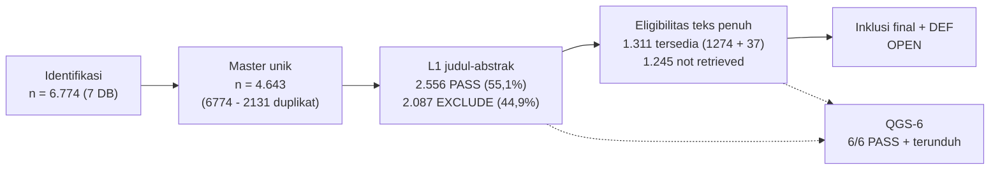

# Progres dan Alur Seleksi (PRISMA 2020)

**Status:** M1 LOCKED · M2 FROZEN · M3 L1 DONE · L2 OPEN (pool 1.311 PDF) · M4–M11 OPEN · hunting 7/9 (WoS + ACM DL OPEN) · QGS-6 6/6 · update 2026-09-14 · [PRISMA](#2-diagram-alir-prisma-2020-linear) · [DONE/NEXT](#3-tabel-donenext-ringkas)

Halaman ini adalah pemilik tunggal angka korpus. Halaman lain hanya menautkan ke sini.

## 1. Sumber hunting final (7/9, v2.2 FROZEN)

| Pangkalan data | n dipakai | Catatan |
|:---|---:|:---|
| Scopus | 769 | Baseline `scopus_20260912_v22_BASELINE.md` |
| arXiv | 824 | Baseline `arxiv_20260912_v22_BASELINE.md` |
| OpenAlex | 2.209 | Cursor paging penuh |
| CrossRef | 360 | Polite pool; 293 DOI baru di luar Scopus |
| IEEE Xplore | 1.059 | REST API; QGS-6 0/6 (non-IEEE) |
| SpringerLink | 1.538 | Partisi 1.000 + 538; GS11 HIT baris 1006 |
| ScienceDirect | 15 | Definisi: 17 rekaman mentah terambil, 15 unik dipakai setelah dedup internal sehingga total korpus 6.774. |
| **Total** | **6.774** | 769+824+2.209+360+1.059+1.538+15 |

Deduplikasi lintas database: 6.774 − 2.131 duplikat (31,5%) = **4.643 naskah unik master** (`02_slr/screening/01_master_for_screening.csv`).

## 2. Diagram alir PRISMA 2020 (linear)

Rincian eksklusi L1 (2.087): EC5-NonSE 1.285, EC3-SingleAgent 504, EC2-Sekunder 236, EC5-Hardware 42, EC6-NonAkademik 8, EC8-Tahun 5, EC7-Bahasa 5, EC5-Game 2. Detail per naskah di [Studi Tereksklusi](excluded.md).

Retrieval dan recovery: L1 PASS 2.556 = 1.274 retrieved Batch-1 (49,8%) + 1.282 not retrieved; recovery union atas 1.282 = 37 retrieved + 1.245 residu; pool L2 = 1.274 + 37 = **1.311 PDF valid**. Kalibrasi pilot L2 50 paper (3 kontrol QGS + 47 acak) menghasilkan 42 konsensus bulat dan 8 sengketa menunggu adjudikasi Schnee; pool L2 tetap 1.311 PDF.

## 3. Tabel DONE/NEXT ringkas

| DONE (2026-09-12 s.d. 2026-09-14) | NEXT (OPEN) |
|:---|:---|
| Query v2.2 FROZEN + QGS-6 6/6 | Hunting WoS + ACM DL (7/9 → 9/9) |
| Hunting 7 DB 6.774 + dedup 4.643 | Tier-3 Wave-1 (10) lalu Wave-2 (21) via proxy kampus |
| L1 4.643: 2.556 PASS / 2.087 EXCLUDE | Tier-4 Reports not retrieved pasca Tier-3 |
| Retrieval 1.274 + recovery 37 = pool 1.311 | L2 fulltext 1.311 → QA/9 + DEF → gap final |
| Pilot L2 50 siap + evaluasi silang 3 model (κ 0,76) | Adjudikasi 8 sengketa pilot oleh Schnee |

## 4. Tier-3 flagship dan Tier-4 interim (pindahan dari excluded §4)

Tier-3: **31 naskah flagship** (CORE A*/A, Scopus Q1) dari residu 1.245, seluruhnya OPEN: Wave-1 10 flagship G3-positif dieksekusi dulu, Wave-2 21 flagship G3-negatif menyusul via proxy kampus/CDP.
Tier-4 interim: **69 naskah non-flagship** kandidat dari 100 teratas; dieksekusi setelah Tier-3; sisa yang tak pulih dilaporkan sebagai *Reports not retrieved* PRISMA. Artefak: `02_slr/retrieval/subagents/results_union_final.json`, `02_slr/retrieval/TIER3_31_flagship_prioritas.md`.
